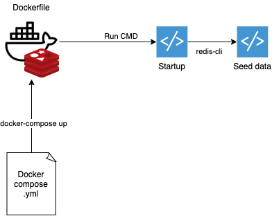

# Redis - Automated container with seed data file

This project is a very simple example of how you can execute an image of Redis with an initial set of data.

## How



## Steps

This project can be divided into three different moments.
* **Dockerfile** - Containing the image construction where we feed the entry point with commands.
* **Script execution** - This scripts will execute when the container is started. The startup file will execute Redis-CLI to run the seed data script to initialize the server. After that, it'll run the Redis server to start the application.
* **Docker compose file** - File used to define services to execute (in this case we'll only have a Redis service from the previous Dockerfile)

## Usage

Run the following command to start the service

```docker
docker-compose up --build -d
```

You can also enter the running container to check if the data is created or not. For that:

```docker
docker ps
```

Copy the container ID and just run

```docker
docker exec -it [CONTAINER_ID] bash
```

## Contributing
Pull requests are welcome. For major changes, please open an issue first to discuss what you would like to change.
